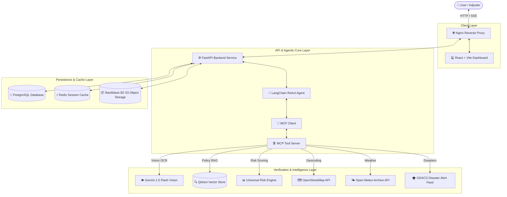

# 🤖 Autonomous Claims Processing System

An enterprise-grade, agentic insurance claims processing platform powered by **LangChain ReAct agents**, **Google Gemini 1.5 Flash Multimodal Vision**, **Qdrant Vector Policy RAG**, **Universal Risk Engine Fraud Scoring**, **Backblaze B2 S3 Storage**, and the **Model Context Protocol (MCP)**.

---

## 🏛️ System Architecture



---

## ✨ Key Features

- **🧠 Autonomous Agentic Decisioning:** LangChain ReAct framework conducts multi-step investigations, calling tools dynamically based on claim type and context.
- **👁️ Multimodal Evidence Inspection:** Gemini 1.5 Flash Vision analyzes submitted damage photos and identity PDFs for authenticity, damage consistency, and fraud flags.
- **🔍 Policy RAG Search:** Semantic retrieval of policy rules and coverage limits using Qdrant vector database and Gemini embeddings.
- **📦 Backblaze B2 S3 Storage:** Cloud object storage integration via `boto3` for secure evidence uploads and presigned asset access.
- **🌐 Real-Time Fact Verification:** Cross-checks claimed incident details against live weather archives (Open-Meteo), geographic coordinates (OpenStreetMap), and natural disaster feeds (GDACS).
- **📊 Universal Risk Engine:** Rule-based and weighted feature risk scoring engine calculating transparent fraud probability scores and reason codes.
- **📡 Server-Sent Events (SSE):** Real-time streaming of agent thought processes, step execution, and decision rationale directly to the UI.
- **🛡️ Role-Based Management:** Tailored portals for **Customers** (submit & track claims), **Adjusters** (adjudicate & manual override), and **Admins** (user management & audit logs).

---

## 📂 Production Microservice Directory Structure

```text
claims-agent/
├── backend/                   # ⚙️ FastAPI API & Agent Infrastructure
│   ├── app/                   # Core application modules & MCP tools
│   ├── Dockerfile             # Standalone Backend container definition
│   └── requirements.txt       # Pinned Python dependencies
│
├── frontend/                  # 💻 React Dashboard User Interface
│   ├── src/                   # React components & state management
│   └── Dockerfile             # Multi-stage Nginx Frontend container definition
│
├── nginx/                     # 🌐 Nginx Reverse Proxy Service
│   └── nginx.conf             # Route load balancing & SSE streaming proxy config
│
├── postgres/                  # 🐘 PostgreSQL Database Service
│   └── init.sql               # Database extensions & setup script
│
├── redis/                     # ⚡ Redis Session Cache Service
│   └── redis.conf             # Production Redis cache configuration
│
├── .python-version            # 📌 Runtime version pin (Python 3.11.9)
├── docker-compose.yml         # 🐳 Full-stack microservice orchestration
└── DEPLOYMENT.md              # 📖 Production Deployment Documentation
```

---

## 💻 Local Development Setup

### 1. Run Backend Locally
```bash
cd backend
cp .env.example .env
# (Configure .env credentials)

pip install -r requirements.txt
uvicorn app.main:app --reload --host 0.0.0.0 --port 8000
```

### 2. Run Frontend Locally
```bash
cd frontend
npm install
npm run dev
```

---

## 📖 Deployment Documentation

For complete Docker Compose orchestration, VPS hosting, and cloud deployment guidelines (Render, AWS, DigitalOcean), refer to **[DEPLOYMENT.md](DEPLOYMENT.md)**.
