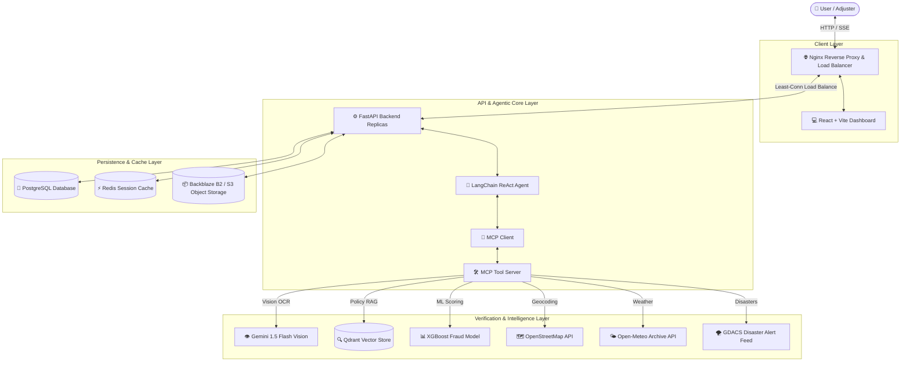

# 🤖 Autonomous Claims Processing System

An enterprise-grade, agentic insurance claims processing platform powered by **LangChain ReAct agents**, **Google Gemini 1.5 Flash Multimodal Vision**, **Qdrant Vector Policy RAG**, **XGBoost Machine Learning Fraud Scoring**, and the **Model Context Protocol (MCP)**.

---

## 🏛️ System Architecture



---

## ✨ Key Features

- **🧠 Autonomous Agentic Decisioning:** LangChain ReAct framework conducts multi-step investigations, calling tools dynamically based on claim type and context.
- **👁️ Multimodal Evidence Inspection:** Gemini 1.5 Flash Vision analyzes submitted damage photos and identity PDFs for authenticity, damage consistency, and fraud flags.
- **🔍 Policy RAG Search:** Semantic retrieval of policy rules and coverage limits using Qdrant vector database and Gemini embeddings.
- **🌐 Real-Time Fact Verification:** Cross-checks claimed incident details against live weather archives (Open-Meteo), geographic coordinates (OpenStreetMap), and natural disaster feeds (GDACS).
- **📊 ML-Powered Fraud Scoring:** Trained XGBoost classifier computes real-time risk scores with feature attribution (SHAP values).
- **📡 Server-Sent Events (SSE):** Real-time streaming of agent thought processes, step execution, and decision rationale directly to the UI.
- **🛡️ Role-Based Management:** Tailored portals for **Customers** (submit & track claims), **Adjusters** (adjudicate & manual override), and **Admins** (user management & audit logs).

---

## 📂 Repository Structure

```text
claims-agent/
├── DEPLOYMENT.md              # 📖 Comprehensive Production Deployment Guide
├── docker-compose.yml         # 🐳 Full-stack single-instance Docker orchestration
├── nginx.conf                 # 🌐 Load balancer & SSE streaming proxy configuration
├── .python-version            # 📌 Runtime version pin (Python 3.11.9)
│
├── backend/                   # ⚙️ FastAPI API & Agent Infrastructure
│   ├── app/                   # Core application modules
│   │   ├── agent.py           # LangChain ReAct agent & fallback pipeline
│   │   ├── mcp_server.py      # MCP Tool Server (RAG, Vision, Fact-check)
│   │   ├── mcp_client.py      # MCP Client subprocess bridge
│   │   ├── ml_service.py      # XGBoost ML fraud prediction model
│   │   ├── rag.py             # Qdrant policy vector search engine
│   │   ├── storage.py         # Backblaze B2 / S3 file upload handler
│   │   ├── auth.py            # JWT Authentication & Redis session manager
│   │   └── main.py            # FastAPI REST endpoints & SSE streaming
│   ├── Dockerfile             # Production Backend container definition
│   └── requirements.txt       # Pinned Python dependencies
│
└── frontend/                  # 💻 React Dashboard User Interface
    ├── src/                   # React components & state management
    └── Dockerfile             # Multi-stage Nginx Frontend container definition
```

---

## 🚀 Quick Start (Local Docker Compose)

To launch the full microservice stack on your local machine:

```bash
# 1. Clone repository
git clone https://github.com/AkshajAnil/Autonomous-claims-application.git
cd Autonomous-claims-application

# 2. Configure environment
cp backend/.env.example backend/.env
# (Edit backend/.env and insert your GEMINI_API_KEY)

# 3. Start single-instance Docker stack
docker-compose up --build -d
```

Access the dashboard at **http://localhost**!

For detailed cloud deployment instructions (Render, AWS, DigitalOcean, VPS), refer to **[DEPLOYMENT.md](DEPLOYMENT.md)**.
